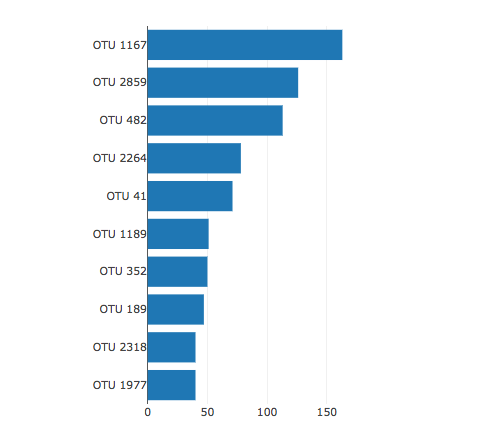

# belly-button-challenge
Module_14_assignment
Dashboard.

# Deployment:

You can access the dashboard through the following link.

# Background:

For this task, you'll create an interactive dashboard to delve into the [Belly Button Biodiversity dataset](https://robdunnlab.com/projects/belly-button-biodiversity/) , documenting the microbial communities inhabiting human navels. The dataset highlights that a select few microbial species, referred to as operational taxonomic units (OTUs) in the study, were found in over 70% of individuals, with the remaining species being comparatively uncommon.

# Instructions|:
Complete the following steps.

1. Use the D3 library to read in 'samples.json' from the URL https://2u-data-curriculum-team.s3.amazonaws.com/dataviz-classroom/v1.1/14-Interactive-Web-Visualizations/02-Homework/samples.json.

2. Create a horizontal bar chart with a dropdown menu to display the top 10 OTUs found in that individual.

* Use 'sample_values' as the values for the bar chart.

* Use 'otu_ids' as the labels for the bar chart.

* Use 'otu_labels' as the hovertext for the chart.

3. Create a bubble chart that displays each sample.

* Use 'otu_ids' for the x values.

* Use 'sample_values' for the y values.

* Use 'sample_values' for the marker size.

* Use 'otu_ids' for the marker colors.

* Use 'otu_labels' for the text values.

4. Display the sample metadata, i.e., an individual's demographic information.

5. Display each key-value pair from the metadata JSON object somewhere on the page.

6. Update all the plots when a new sample is selected.

7. Deploy your app to a free static page hosting service, such as GitHub Pages. Submit the links to your deployment and your GitHub repo. Ensure that your repository has regular commits and a thorough README.md file